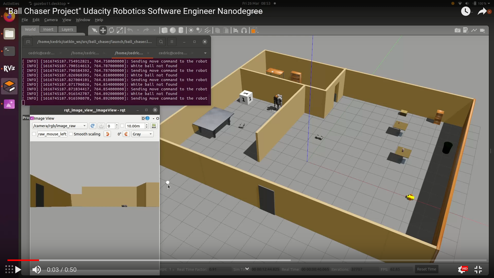
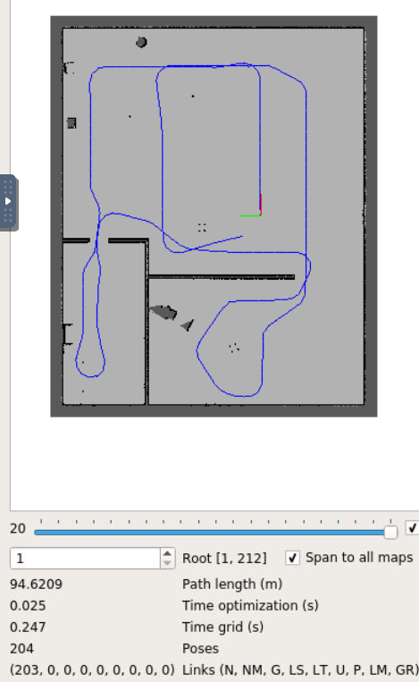
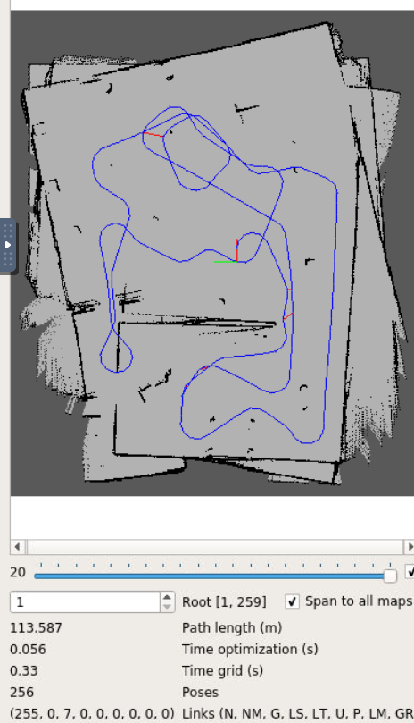
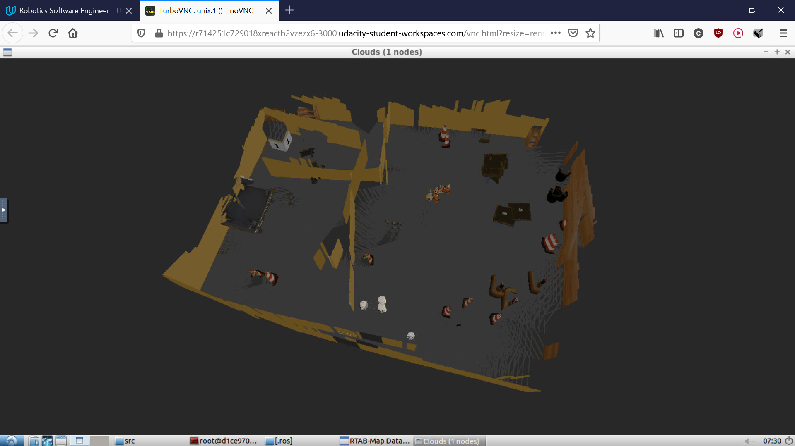

# Udacity-Map-My-World

## Overview
Fourth project in Udacity's Robotics Software Engineer Nanodegree. The goal of the project is to implement RTAB-Map, a ROS package for visual SLAM using a laser range finder with a RGB-D camera.
This was implemented leveraging the same world and robot created in the previous projects of the same course.

Video:

[](https://www.youtube.com/watch?v=ZymFv-S-eno)

Made under ROS-Kinetic and Gazebo-7.

**Author: Cedric Perney**

## Installation
- Make sure to have a working installation of ROS-Kinetic
- Clone this git repository on your local computer, check/install any missing dependencies and compile the package:
```
cd catkin_ws/src
git clone https://github.com/cedre266/Udacity-Map-My-World.git
cd ../
rosdep install --from-paths . --ignore-src
catkin_make
```

## Usage
- Source at the root
```
cd  catkin_ws/
source devel/setup.bash
```
- Launch the Gazebo simulation with the robot and Rviz
```
roslaunch my_robot world.launch
```
- In a second terminal, launch teleoperation to control the robot with the keyboard
```
rosrun teleop_twist_keyboard teleop_twist_keyboard.py
```
- In a third terminal, launch the mapping node:
```
roslaunch my_robot mapping.launch
```
- Now use the teleoperation to move the robot around in the map. When having finished, shut down the mapping node. It will save the database as `~/.ros/rtabmap.db`.
- In order to view the results, we can use the database viewer provided with the RTAB-Map package. By default, there are saved to the `~/.ros/` folder. This can be changed in `mapping.launch` if needed.
```
rtabmap-databaseViewer ~/.ros/rtabmap.db
```
If you want to open the file already there in the repository, replace the path to point to the file `rtabmap_final.db`:
```
rtabmap-databaseViewer PATH/TO/rtabmap_final.db
```
- Say yes to using the database parameters
    - `View` -> `Constraint View`
    - `View` -> `Graph View`
- You should be able to see RGB images of the camera, that highlights in yellow detected features and in pink detected loop closures candidates. A second view shows an occupancy grid map with the trajectory. A third view, in 3D, allows to see how neighbouring links and loop closures candidates were detected.
- A 3D map of the environment can be generated:
    - `Edit` -> `View 3D map`
    - `Ok`

## Launch files
- **`world.launch`**: launches the Gazebo with the saved world, launches `robot_description.launch` which finds the xacro description file of the robot and sends the robot states to tf, spawns the robot at the specified initial pose
- **`mapping.launch`**: launches the `rtabmap` node, remapping input parameters to this particular robot and setting other parameters such as those for output, loop closure, feature detection, etc
- **`localization.launch`**: launches the `rtabmap` node in localization mode, meaning that instead of creating a map, it is using an already existing map to detect if current images from the robot correspond to images in the map (loop closures) in order to localize itself

## Related Documentation
The RTAB-Map package: http://wiki.ros.org/rtabmap_ros

## Illustrations and Comments
Multiple tries were necessary to obtain a successful map with loop closures. Please view the video in overview for a successful one.
Previous ones were facing two main issues:
- The first issue is to not have enough features in the simulated world. Because of not having enough visual clues, the robot could not identify places it had already visited before in order to find loop closures. The result was a good map overall, but it could not have scaled to be used on bigger maps, since a longer mapping would have resulted in a drift appearing over time, without having any loop closure to counter that. The issue was solved by adding additional features in the simulated world.

World with too few features:


2D map and trajectory obtained, but not a single loop closure detected, though parts of the trajectory clearly overlap:


- The second issue is to have wrong loop closures. If the robot's trajectory overlaps are too short or not close enough, loop closures will be detected and will try to optimize the trajectory so that two places that are not really the same get merged, resulting in significant shifts in the map. This issue can be solved by having better trajectory overlaps.

This is a trajectory that did not have good enough overlaps. Note how it detected loop closures that connected points of the trajectory that were not always very close to each other, like at the top of the image (red line):


This is the resulting map. Wrong loop closures clearly created problems in the mapping. Walls are not aligned and some objects appear 3 or 4 times due to misalignments:

