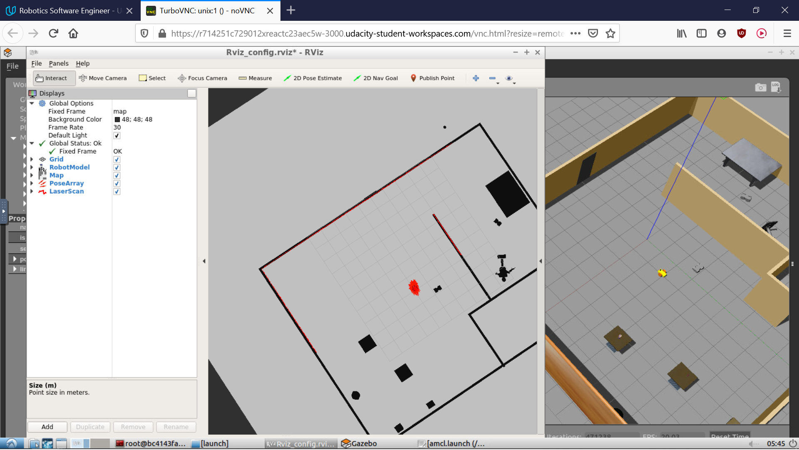
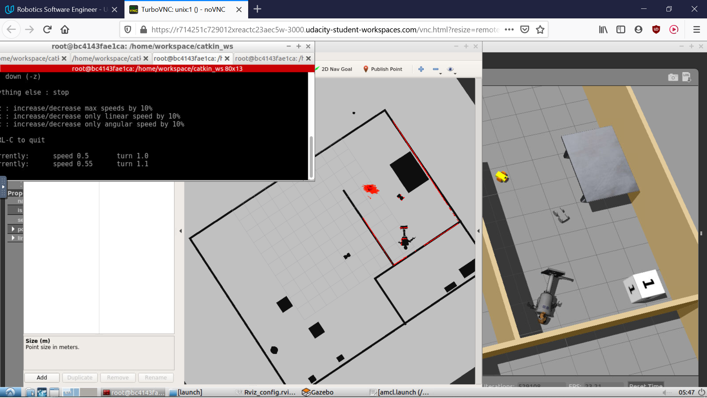
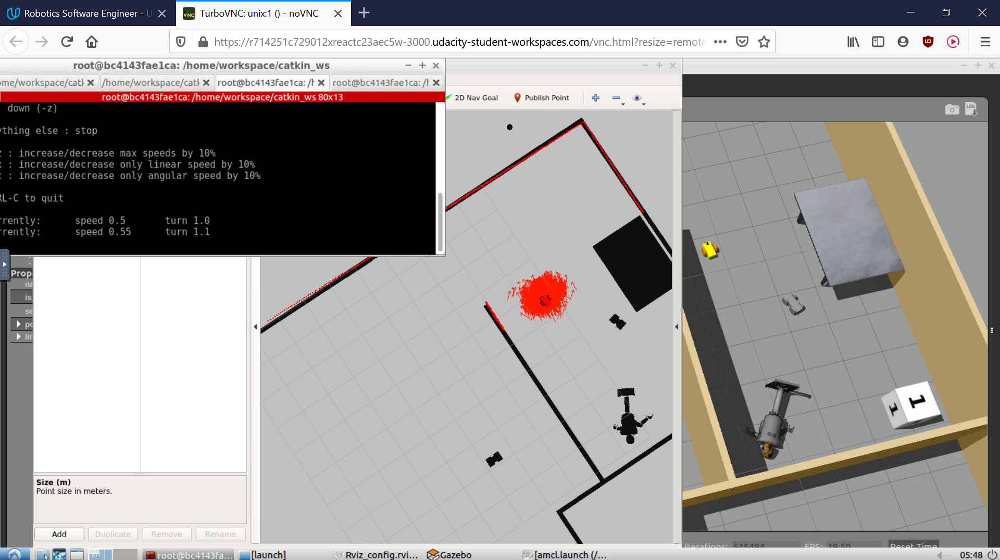
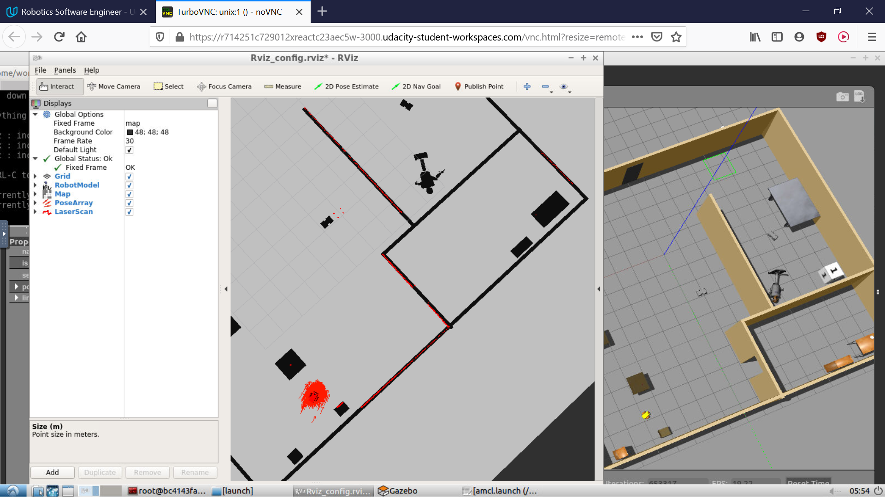
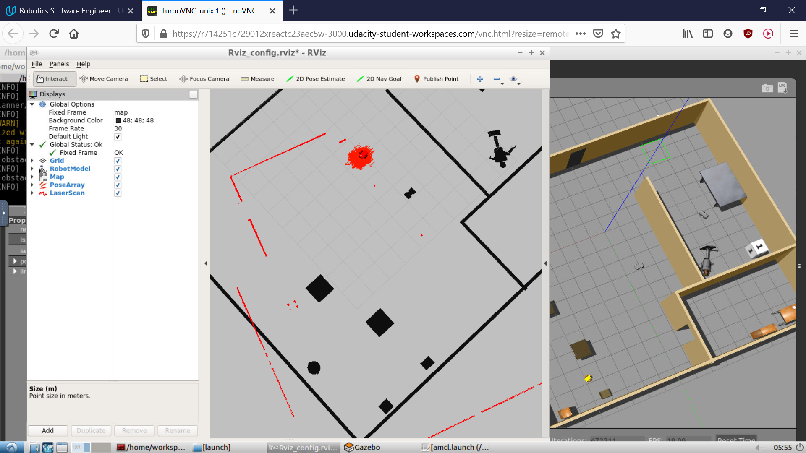
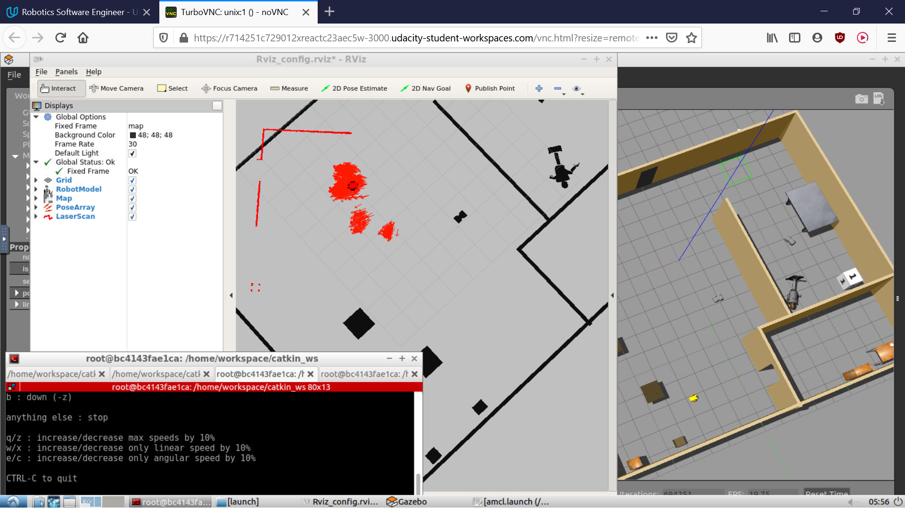
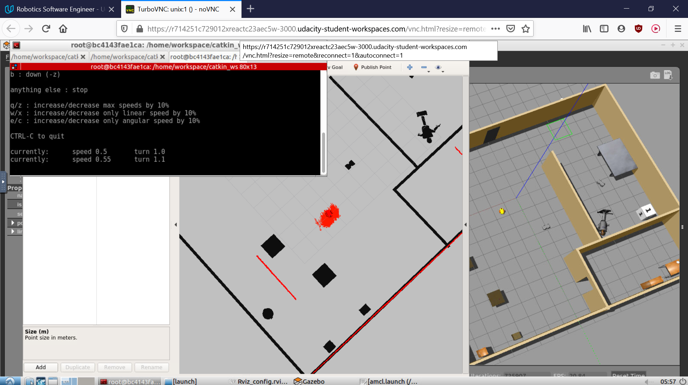

# Udacity-Where-Am-I

## Overview
Third project in Udacity's Robotics Software Engineer Nanodegree. The goal of the project is to localize the robot with the Monte-Carlo localization (MCL) algorithm.
This was implemented leveraging the same world and robot created in the previous projects of the same course. The MCL algorithm used is the amcl (adaptive MCL) ROS package.



Made under ROS-Kinetic and Gazebo-7.

**Author: Cedric Perney**

## Installation
- Make sure to have a working installation of ROS-Kinetic
- Clone this git repository on your local computer, check/install any missing dependencies and compile the package:
```
cd catkin_ws/src
git clone https://github.com/cedre266/Udacity-Where-Am-I.git
cd ../
rosdep install --from-paths . --ignore-src
catkin_make
```

## Usage
- Source at the root
```
cd  catkin_ws/
source devel/setup.bash
```
- Launch the Gazebo simulation with the robot and Rviz
```
roslaunch my_robot world.launch
```
- In a second terminal, launch the adaptive Monte-Carlo localization
```
roslaunch my_robot amcl.launch
```
- In Rviz, open the config file `Rviz_config.rviz`
- The localization should now be visible in Rviz. There are two possibilities for navigating the robot and testing the localization:
    - Use the `2D Nav Goal` in Rviz. Pointing on a place on the map will command the robot to get to that position.
    - Use the teleoperation package to command the robot with the keyboard. In a new terminal:
    ```
    rosrun teleop_twist_keyboard teleop_twist_keyboard.py 
    ```

## Launch files
- **`world.launch`**: launches the Gazebo with the saved world, launches `robot_description.launch` which finds the xacro description file of the robot and sends the robot states to tf, spawns the robot at the specified initial pose and launches Rviz
- **`amcl.launch`**: launches the `map_server` node for getting the map, launches the `amcl` node for the Monte-Carlo localization with the specified parameters and launches the `move_base` node to allow navigation commands through Rviz

## Related Documentation
The amcl package: http://wiki.ros.org/amcl
Create the map: https://github.com/udacity/pgm_map_creator

## Illustrations and Comments
Here is an example of the robot localizing itself. Another example was shown in the overview section. In both images, it can be seen that the particles are well located around the robot's real pose, and that the laser scans are well aligned with the map.


It appears that the localization performs better when the robot is moving straight compared to when it is rotating. The image below has been taken after a simple 180° rotation of the robot on itself. The particles are much more spread out around the robot, showing a bigger uncertainty on the real pose.


After commanding the robot to go straight for a small distance, the particles form again a very narrow cloud around the robot's location.


### Simulating the "kidnapped robot" problem
The kidnapped robot problem is the most difficult problem to solve in localization. It consists of moving the robot to a different pose without giving the robot any clue, and see whether it is capable of recovering its real pose again. In order to try this here, it is possible to command the robot to a certain pose, then deactivate the amcl node and reactivate it so that the robot believes it is located at its initial pose. Then, the robot can be moved to see whether the particles manage to find the robot's real pose again or not.

Here is what happens. At first, the robot is moved to some location and it could successfully localize itself. (Note that the laser scans do not align on the little gray vehicle in Rviz. This is due to that vehicle having moved when the map was created. The laser scans show the real location of that vehicle, which is aligned with the wall on the right. It shows how this localization approach is limited to mostly static environments.)


Then, the amcl node has been deactivated and reactivated. The robot believes it is located at its initial pose. The laser scans do not match at all.


After commanding the robot to move for a while, the particles separate themselves into multiple clouds as each particle tries to fit the laser scans to the map to find its location.


Finally, the particles converged to a solution. However, the found solution is a wrong location. The laser scans only partially alignn with the map, but that was enough to make the particles converge there. This is certainly because the map consists of multiple long walls, so they are easy to confuse with each other.


It shows then that the robot is in this case not able to recover. In order to let him recover, there could be two possibilities. The first one is to manually give the robot an estimate of its real pose through the `2D Pose Estimate` button in Rviz. As the particles, in this configuration, spread only around the initial pose or manually given estimate, some particles will cover the real pose and allow the robot to recover. The second solution could be changing the particles configuration so that they are initially spread over the entire map. This solution, however, would be obviously limited by the number of particles the computation can afford and the bigger the map, the more it would struggle.
